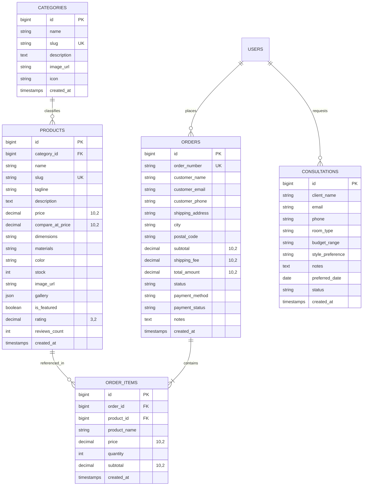

# Backend Agent Guidelines (L'Atelier Interior Shop)

These guidelines are mandatory for all AI agents and developers building and maintaining the Laravel backend application.

---

## 1. Architecture, Folder Structure & Clean Code (DRY)

1. **Always Follow the DRY Principle (Don't Repeat Yourself)**:
   - Extract recurring queries, business logic, calculations, and data formatting into dedicated services, traits, or helper classes.
   - Never duplicate validation rules or authorization checks across multiple controllers.

2. **Clean Layered Architecture**:
   - **Controllers (`app/Http/Controllers/Api/`)**: Thin controllers only. Responsible for receiving requests, invoking service layers, and returning standardized API responses.
   - **Form Requests (`app/Http/Requests/`)**: Encapsulate all incoming validation and authorization logic.
   - **Services (`app/Services/`)**: House all core business logic, database transactions (`DB::transaction`), and external integrations.
   - **Eloquent Models (`app/Models/`)**: Contain relationships, query scopes, casts, and model mutators.
   - **API Resources (`app/Http/Resources/`)**: Standardize outbound JSON payload transformations.

---

## 2. High-Performance Database & Query Optimization

1. **Mandatory Eager Loading (Eliminate N+1 Queries)**:
   - **Always eager-load relationships** in your controller or service classes before returning data or passing it to views:
     ```php
     // CORRECT: Eager loaded
     $products = Product::with(['category', 'orderItems'])->paginate(12);

     // FORBIDDEN: Causes N+1 database queries
     $products = Product::all();
     ```
   - Enforce eager-loading prevention in non-production environments using `Model::preventLazyLoading(!app()->isProduction())`.

2. **Database Transactions**:
   - Any operation mutating multiple database tables (e.g., checkout orders + order items + stock decrement) must run inside `DB::transaction()`.

---

## 3. View & Presentation Layer Guidelines (Blade & Rendering)

1. **Zero Database Queries & Heavy Logic Inside Blade**:
   - **Never** execute Eloquent queries (e.g., `Category::all()`, `$user->orders()`) or complex business computations inside Blade templates.
   - All data must be prepared, filtered, and aggregated inside controllers or view composers before being injected into the view.

2. **Minimize Heavy Component Nesting & `@include` Loops**:
   - Avoid deep component trees and nested `@include` directives inside iterative loops (`@foreach`), as each directive adds template parsing overhead.
   - Prefer lightweight inline loops or pre-rendered collections.

3. **Cache Computationally Expensive View Fragments**:
   - For view fragments that require extensive computation or aggregation (e.g., complex navigation trees, mega-menus, widgets, statistical summaries), cache the compiled HTML string directly using Laravel's cache:
     ```php
     $navigationHtml = Cache::remember('global_navigation_menu', now()->addDay(), function () {
         return view('partials.navigation', ['categories' => Category::with('children')->get()])->render();
     });
     ```

---

## 4. Server Performance, Octane & Web Server Optimization

1. **Serve via Laravel Octane**:
   - For ultra-low latency and maximum request throughput, serve the application using **Laravel Octane** (powered by FrankenPHP, Swoole, or RoadRunner).
   - Octane boots the application once into shared RAM and keeps it warm across requests, completely bypassing framework bootstrap overhead.
   - **Statelessness Rule**: Avoid memory leaks under Octane by never storing request-specific state in singleton services or static properties without resetting them.

2. **Enable Gzip or Brotli Compression**:
   - Blade and API responses output plain text (`text/html`, `application/json`).
   - Ensure the reverse proxy or web server (FrankenPHP, Nginx, Caddy) has **gzip** or **brotli** compression enabled to drastically decrease payload sizes over the wire.

3. **PHP OPcache Optimization**:
   - OPcache compiles PHP scripts into precompiled bytecode stored in shared memory. Ensure the following production settings are active in `php.ini`:
     ```ini
     opcache.enable=1
     opcache.memory_consumption=256
     opcache.max_accelerated_files=20000
     opcache.validate_timestamps=0
     ```

---

## 5. Framework & Application Caching

1. **Production Optimization (`php artisan optimize`)**:
   - Running all production caches ensures Laravel skips route parsing, configuration reading, and service discovery on every incoming HTTP cycle:
     ```bash
     php artisan optimize
     ```
   - This command compiles:
     - `php artisan config:cache` (Caches environment and config files)
     - `php artisan route:cache` (Pre-compiles route matching tables)
     - `php artisan view:cache` (Compiles all Blade templates)
     - `php artisan event:cache` (Caches event listener discovery)

2. **Cache Clearance for Development**:
   - When developing locally or updating configuration files, reset the compiled caches with:
     ```bash
     php artisan optimize:clear
     ```

---

## 6. Enterprise Database Architecture (MariaDB 13)

### A. Entity-Relationship Model (ERD)



### B. Indexing Strategy & Performance Rules

1. **Composite Filtering Indexes**:
   - Catalog filtering involves querying by category, featured flag, and sorting by price simultaneously. Maintain the composite index:
     ```php
     $table->index(['category_id', 'is_featured', 'price']);
     ```
   - For order dispatch workflows, index queue lookups:
     ```php
     $table->index(['status', 'created_at']);
     ```
   - For design consultation scheduling:
     ```php
     $table->index(['status', 'preferred_date']);
     ```

2. **Lookup Key Uniqueness**:
   - All slug fields (`categories.slug`, `products.slug`) and reference numbers (`orders.order_number`) must possess `UNIQUE` B-Tree indexes for $O(1)$ point lookups.

3. **Foreign Key Indexing**:
   - In MariaDB/MySQL, foreign key constraints (`constrained()`) automatically create an index. Always declare foreign keys explicitly with proper cascade rules.

---

### C. Data Integrity, Precision & Cascading Rules

1. **Currency & Financial Precision**:
   - **Never** use `float` or `double` for money. Floating-point imprecision creates rounding drift across order calculations.
   - Always use `decimal(10, 2)` for prices, subtotals, tax, and shipping calculations.

2. **Historical Immutability Pattern (Order Items)**:
   - When an order is placed, snapshot the `product_name` and `price` directly into `order_items`. If the master product price changes or the item is discontinued in the future, the customer's historical receipt remains legally and financially accurate.
   - Use `nullOnDelete()` on `order_items.product_id` so that deleting a catalog product does **not** erase or corrupt historical sales records.
   - Use `cascadeOnDelete()` on `order_items.order_id` so removing a discarded order cleans up its children automatically.

3. **Stock & Inventory Concurrency**:
   - Always adjust inventory within an atomic transaction with row locking if under high concurrency:
     ```php
     DB::transaction(function () use ($productId, $quantity) {
         $product = Product::where('id', $productId)->lockForUpdate()->firstOrFail();
         if ($product->stock < $quantity) {
             throw new InsufficientStockException();
         }
         $product->decrement('stock', $quantity);
     });
     ```

---

### D. MariaDB 13 Storage & Collation Standards

- **Storage Engine**: `InnoDB` with `ROW_FORMAT=DYNAMIC`.
- **Character Set & Collation**: `utf8mb4` with `utf8mb4_unicode_ci` to support international characters, accents, and symbols across interior design specifications.
- **Connection**: Configured via Laravel's native `'mariadb'` connection driver in `config/database.php`.

